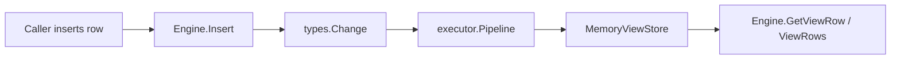
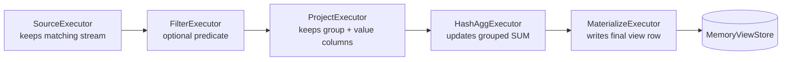
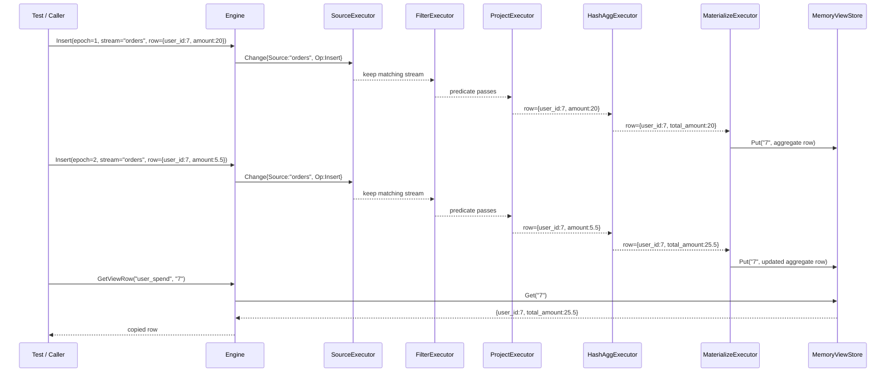
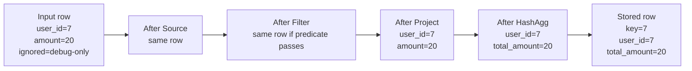
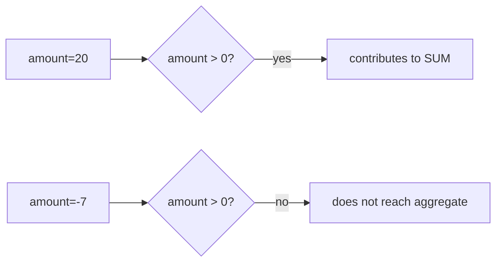
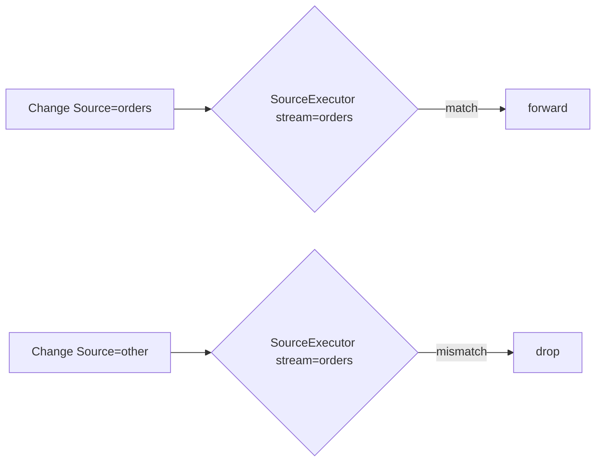

# PR 2 Executor Pipeline Diagrams

This document explains the PR 2 executor pipeline visually. PR 2 replaces the earlier hard-coded materialized-view update path with a small RisingWave-inspired executor chain.

## 1. Big picture



The engine still exposes a simple API, but the actual view maintenance now happens inside an executor pipeline.

## 2. PR 2 pipeline shape



For the first SUM materialized view, the pipeline is:

```text
Source -> Filter -> Project -> HashAggregate -> Materialize
```

## 3. Concrete `orders -> user_spend` flow



## 4. What each executor does

```mermaid
flowchart TB
    subgraph SourceExecutor
        S1[Input Change]
        S2{Source == stream?}
        S3[Forward]
        S4[Drop]
        S1 --> S2
        S2 -- yes --> S3
        S2 -- no --> S4
    end

    subgraph FilterExecutor
        F1[Input Change]
        F2{Predicate nil or true?}
        F3[Forward]
        F4[Drop]
        F1 --> F2
        F2 -- yes --> F3
        F2 -- no --> F4
    end

    subgraph ProjectExecutor
        P1[Input Row]
        P2[Copy selected columns]
        P3[Forward projected row]
        P1 --> P2 --> P3
    end

    subgraph HashAggExecutor
        A1[Input projected row]
        A2[Read group key]
        A3[Add amount to group sum]
        A4[Emit aggregate row]
        A1 --> A2 --> A3 --> A4
    end

    subgraph MaterializeExecutor
        M1[Input aggregate row]
        M2[Derive materialized key]
        M3[Put row in MemoryViewStore]
        M1 --> M2 --> M3
    end
```



## 5. Data shape at each stage

Given this input:

```go
types.Row{
    "user_id": 7,
    "amount": 20.0,
    "ignored": "debug-only",
}
```

The row changes like this:



On the next row for `user_id=7` with `amount=5.5`, `HashAggExecutor` emits:

```text
user_id=7, total_amount=25.5
```

`MaterializeExecutor` overwrites the stored row for key `7` with the latest aggregate value.

## 6. How filtering works



This is covered by `TestSumViewFilterUsesExecutorPipeline`.

## 7. How source gating works



This lets future engines route many streams through many view pipelines safely.

## 8. Current limitations

PR 2 intentionally keeps the executor model small:

- only insert changes are supported by `HashAggExecutor`;
- there is no `Message` wrapper yet;
- barriers are not propagated yet;
- there is no checkpointing yet;
- aggregation state is in-memory only;
- the pipeline is built manually by `CreateSumView`, not by SQL planning.

These limitations line up with PR 3, where the next step is to introduce messages, barriers, and checkpoint-oriented epoch flow.
